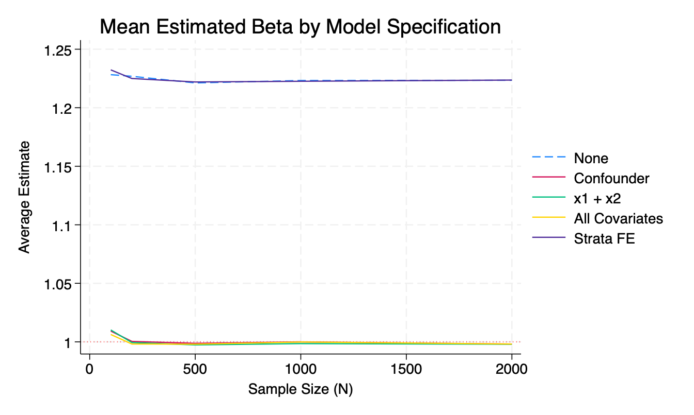
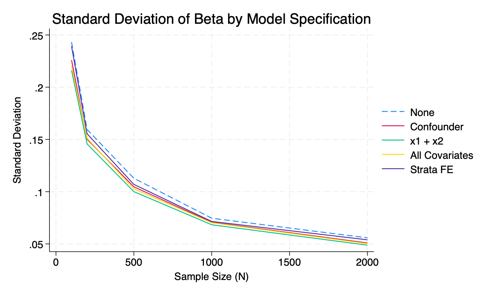

# README - Assignment 3: Simulation, Power, and Bias

**Author:** Homar A. Maurás Rodríguez  
**Course:** PPOL 6818 - Experimental Design  

---

## Overview
This assignment explores statistical power and bias in treatment effect estimation across different experimental designs and model specifications. It includes individual-level simulations, cluster randomization power analyses, and a comparison of biasedness and variance across several regression models.

---

## Part 1: Power Calculation (Individual-Level Randomization)
- Simulated 10,000 individuals where the outcome \( Y \sim N(0,1) \)
- Treatment effect of 0.1 was added to treated group (50% assigned)
- Used `power twomeans` to compute required sample size:
  - Required: **3,142** individuals
  - Adjusted for 15% attrition: **3,696**
  - Scenario with only 30% treated (and 70% control) required: **4,424**

---

## Part 2: Power in Cluster Randomized Trials
- Designed a simulation of 200 clusters (schools) with ICC (rho) = 0.3
- Randomly assigned treatment at the school level
- Treatment effects varied uniformly from 0.15 to 0.25
- Simulated power across increasing **cluster sizes** (2 to 1024):
  - Power improved with larger cluster sizes
- Also simulated power as a function of **number of clusters** while fixing cluster size at 15

---

## Part 3: De-biasing Treatment Effect Estimates
- Simulated five model specifications under increasing levels of adjustment:
  - **Model A:** No covariates
  - **Model B:** Confounder (x1)
  - **Model C:** Confounder + outcome-only variable (x2)
  - **Model D:** All covariates (x1, x2, x3)
  - **Model E:** Strata fixed effects
- Models were tested across sample sizes: 100, 200, 500, 1000, 2000
- Two key plots summarize the findings:

### Figure 1. Mean Estimated Treatment Effect by Model

- Models B to E converge closely to the true effect (β = 1)
- Model A (no adjustment) overestimates treatment effect consistently

### Figure 2. Standard Deviation of Treatment Effect Estimates

- Standard deviation of β̂ decreases with sample size
- More complete models (especially Model D and E) show lower variance

---

## Key Takeaways
- Covariate adjustment and fixed effects help reduce both bias and variance
- Cluster randomized trials require careful planning of cluster size and number
- Power calculations must account for attrition and treatment assignment ratios

---

## File Descriptions
- `stata_assignment_3_homar.do` – main script running all parts
- `model_betasim_output.dta` – simulation output for Part 3
- `cluster_power.dta` – simulation output for cluster power
- `plots/mean_beta_plot.png` – figure for mean estimates
- `plots/sd_beta_plot.png` – figure for standard deviation of estimates
