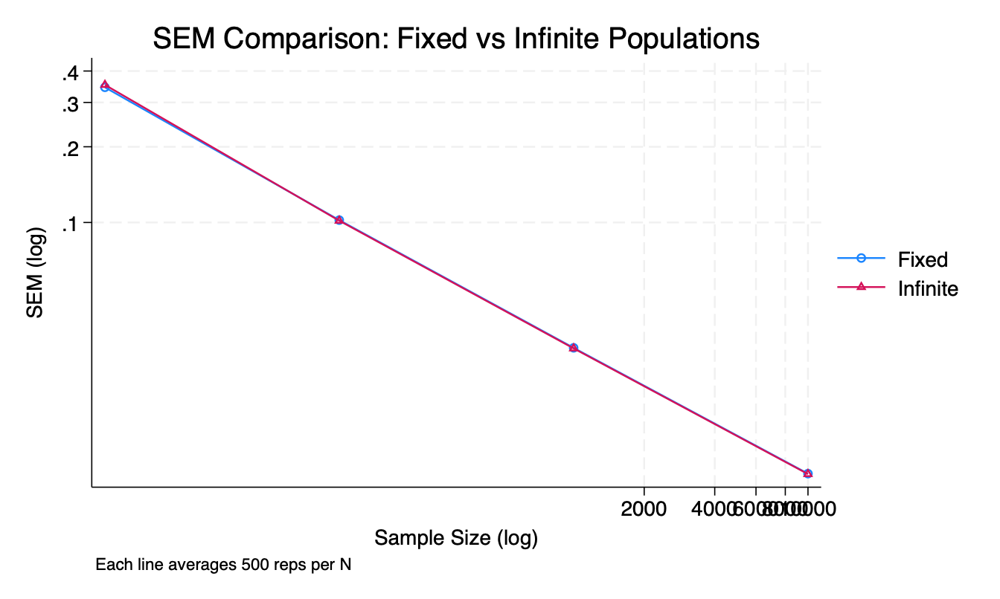

# README - Assignment 3: Finite vs Infinite Population Simulations

**Author:** Homar A. Maurás Rodríguez  
**Course:** PPOL 6818 - Experimental Design  

---

## Overview
This assignment explores how sampling noise affects regression estimates depending on whether we draw from a fixed finite population or an infinite superpopulation. It uses simulation-based analysis to examine the variability of OLS coefficients and standard errors across increasing sample sizes. Results are visualized through figures comparing beta estimates, SEMs, and sampling distributions.

---

## Part 1: Sampling Noise in a Fixed Population
- A dataset of 10,000 observations was generated where:
  - \( x \sim N(0,1) \)
  - \( e \sim N(0,1) \)
  - Outcome: \( y = 2x + e \)

- Simulated repeated sampling from this fixed population at sizes: **10, 100, 1000, 10,000**
- For each sample, we ran OLS and stored:
  - Sample size (N)
  - Coefficient estimate (β̂)
  - Standard error (SEM)
  - Confidence intervals

- Summary plots were created:
  - **Mean SEM vs Sample Size**
  - **Standard Deviation of β̂ vs Sample Size**

These demonstrate that as sample size increases, the variability and SEM of estimates decrease, confirming consistency of OLS.

---

## Part 2: Sampling Noise in an Infinite Superpopulation
- For each simulation, new data were generated with the same DGP as Part 1:
  - \( x \sim N(0,1) \), \( e \sim N(0,1) \), \( y = 2x + e \)
- Sample sizes included:
  - First 20 powers of 2: 4 to 2,097,152
  - Powers of 10: 10, 100, 1000, ..., 1,000,000

- Each simulation was run 500 times and results were appended
- Plots produced:
  - **Beta estimate distribution by N** (with loess fit)
  - **SEM by N (log scale)**

- A table of mean β̂, SEM, and SD of β̂ was generated by sample size.

---

## Comparison of Finite vs Infinite Population
- Summary stats from Part 1 and Part 2 were collapsed and merged
- A final plot visualizes SEM on a log-log scale for both populations:

### Figure 1: Standard Error Comparison

- SEM decreases faster in the infinite population, especially at low N
- Finite population exhibits slightly more noise due to resampling without regeneration

---

## Files Included
- `stata_assignment_3_homar.do` – script for all simulations and plots
- `population.dta` – fixed population data used in Part 1
- `results_all.dta` – combined simulation results for fixed population
- `results_infinite.dta` – combined simulation results for infinite population
- `sem_comparison.png` – figure comparing SEM across both settings
- `plots/` – folder with exported figures from all parts
