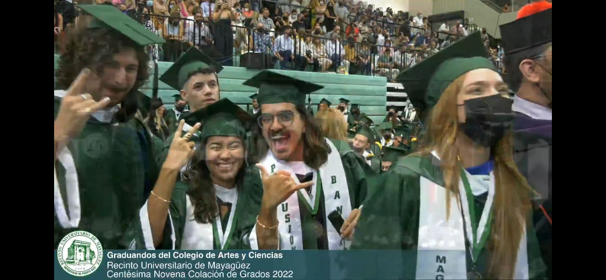

# ¡Dímelo!

My name is **Homar A. Maurás Rodríguez** (They/Them) and I'm from a small town called Caguas (named after the *Cacique* aka *Taíno chieftan*, **Caguax**) in the mountains of a small archipelago in the Caribbean, called Puerto Rico (or as we natives prefer to call it, **Borikén**).

 

 I graduated from the University of Puerto Rico with a double bachelor's in Political Science and Economics, where I conducted research on ***offshore wind farm viability in Puerto Rico*** and ***the effects of political stability on development in the Southeast Asian Tigers***.

 

 For the past 6 years, I've worked in the non-profit sector, aiding community-based projects throughout the **Caribbean** and **Central America**. I moved to DC in 2022 to work as a researcher and educator in civics and government for the Close Up Foundation, where I was fortunate to have worked with over 600+ students from all corners of the US! 

 

 At McCourt, I honed my quantitative skillset and explored my policy interests in new contexts. I was fortunate enough to have spent my summer with the ***International Initiative for Impact Evaluation (3ie)***, where I co-developed a scenario modeling tool that aided women's economic collectives in the weaving industry in Telangana and Andhra Pradesh, and collected remote sensing index applications for a aquaculture project in Bangladesh. As graduation approaches, I am looking to leverage all of the wonderful lessons I've learned in the MIDP program in experiences surrounding geospatial analysis, geographic/land economics, and urban/infrastructure policy.

 In my free time, you can find me knitting, listening/rating albums, reading, playing video games, and petting my beloved black cat, Suki <3.

 

## My latest 10/10 album: DeBÍ TiRAR MáS FOToS - Bad Bunny

DtMf is Bad Bunny's greatest masterpiece yet. The album is a love letter to Puerto Rico and it's abundantly colorful musical history. This genre-bending project is comprised of:

- Dembow (featured in "NUEVAYoL")
- House (ft. in "EL CLúB")
- Plena (ft. in "WELTiTA", "CAFé CON RON", and "DtMF")
- Salsa (ft. in "BAILE INoLVIDABLE" and "LA MuDANZA")
- Nova Trova/Música Tropicale/Bomba (ft. in "PIToRRO DE COCO", "LO QUE LE PASÓ A HAWAii", "TURiSTA")
- Reggaetón (ft. in "VeLDÁ", "KETU TeCRÉ", and "KLOuFRENS")
- Reggaetón old school (ft. in "EoO")
- Neoperreo/Hyperpop/Electronica (ft. in "PERFuMITO NUEVO")
- And other subgenres! 

The work's biggest imprint lies in the communities that Bad Bunny highlights– Puerto Ricans who have been priced out of paradise, their homelands. The following short depicts the struggles that Puerto Rican livelihoods face amid the threats of American gentrification:   

[DtMf Short Film](https://www.youtube.com/watch?v=gLSzEYVDads&ab_channel=BadBunny)